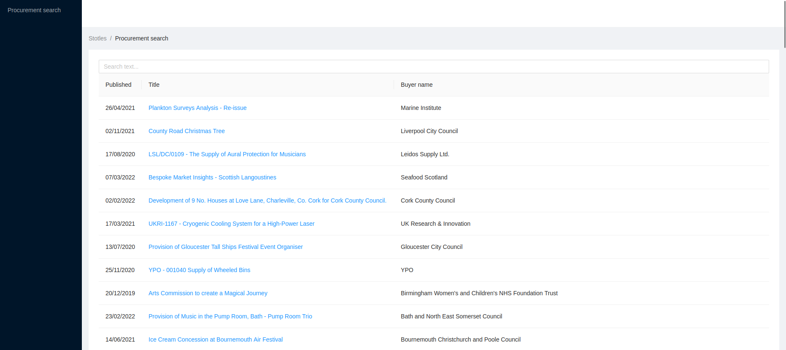

# Stotles work sample assignment

## Getting started

This sample codebase consists of a separate client & server code.

It's set up in a simple way to make it as easy as possible to start making changes,
the only requirement is having recent versions of `node` & `npm` installed.

This is not a production ready configuration (nor production ready code),
it's only set up for easy development, including live reload.

To run the client bundler:

```
cd client
npm install
npm run dev
```

The processed code will be available at http://localhost:3001

To start the server:

```
cd server
npm install
npm run dev
```

The server will be available at http://localhost:3000 - the page is automatically configured
to use the assets served by vite on port 3001.

You should see something similar to this page:



### Disabling/Enabling TypeScript

If you prefer to completely disable TypeScript for a file, add `// @ts-nocheck` on the first line.
If on the other hand you'd like to enable strict type checking, modify `tsconfig.json` according to your needs.

Note that you can import plain JavaScript files that won't be fully typechecked.

### Browsing the database

You should start by looking at the migration in `./migrations` folder.
If you prefer to browse the DB using SQL, you can use the sqlite command line (just run `sqlite3 ./db.sqlite3`)
or any other SQL client that supports sqlite.

If for any reason the database becomes unusable, you can rebuild it using `./reset_db.sh` script`.

## The task

All the instructions are available [here](https://www.notion.so/stotles/Full-stack-software-engineer-work-sample-assignment-ae7c64e08f2a42a097d16cee4bc661fc).

## Comments by Dhanya

# Improvements that could have been done if time permitted
1. Adding tests
2. Adding a CI/CD pipeline
3. Refactoring RecordSearchFilter and Preview page
4. Functionality wise - Making Buyers Filter multiple instead of single , having a search 
5. Making the title show elipsis 
6. Having search for buyer as well
7. Having sort on necessary columns
8. Stress testing by adding more data 
9. DB Wise some more corrections , why some columns are strings and not numbers , placement of buyer Id , date (UTC?)
10. Altering the pagination logic , though offset is ok now (validation of it is not done and better to get a specific block of data better) [[based on stress test results]] , moving the search out separately
11. Folder restructure
12. Logging persisted (for reference)


# Changes done
1. Adding title to be searched as well
2. Adding Value of tender (Some issues were noted when currency added and thus handled)
3. Adding logic for the date (Future date tested)
4. Adding Buyer Filter (New component)
5. Cleaning up the server/client side main to add try catch , add some validations
6. USing ORM instead of query
7. Clean up of the rendering the records so that there is a loading symbol
8. Screens shots attached for proof


